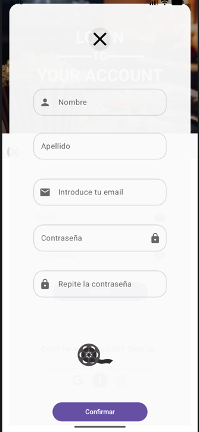
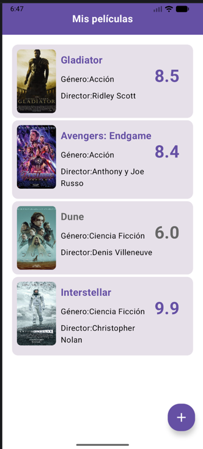
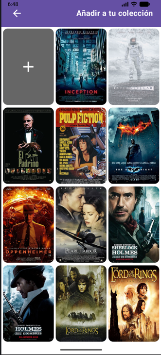
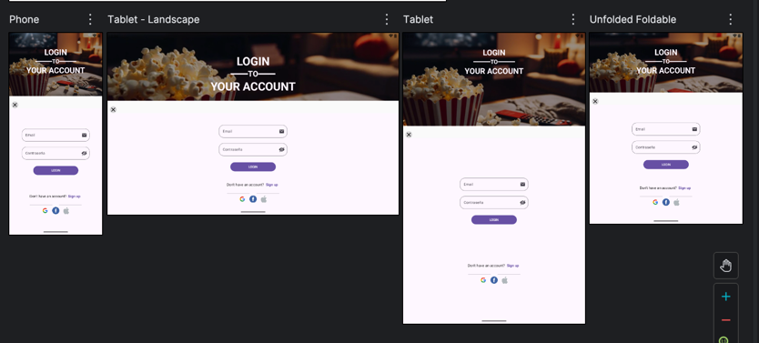

# FilmFlyer

Aplicación Android hecha con Kotlin y Jetpack Compose como proyecto de práctica.

## Descripción

La aplicación permite:

- Navegación básica entre varias pantallas
- Inicio de sesión simulado
- Registro de usuarios
- Crear una colección personal de películas
- Añadir y eliminar películas
- Catálogo ampliable mediante formularios

También se han implementado algunos gestos y componentes de Material 3 como:

- Swipe para eliminar películas
- FloatingActionButton
- Cards
- Scaffold
- OutlinedTextField

## Material Design
La interfaz utiliza Material Design 3 (Material3) mediante Jetpack Compose, combinando elementos dinámicos como swipe gestures, animaciones, cards, formularios y layouts adaptativos para distintos tamaños de pantalla.

## Responsive Design

Se han probado distintos layouts para:

- móviles
- tablets
- desktop preview
- foldables
- sus correspondientes landscapes

Parte del soporte para foldables todavía no está terminado completamente, especialmente en navegación y adaptación final de algunos layouts.

## Componentes reutilizables

Se ha creado un componente reutilizable para los campos de texto (CampoReutilizable) para evitar repetir código en varios formularios.

## Tecnologías utilizadas
- Kotlin
- Jetpack Compose
- Material 3
- Navigation Compose
- Android Studio

## Capturas

### Login

### Registro

### Pantalla principal

### Galería

## Previews

## Autor

Damian Lucas Olate